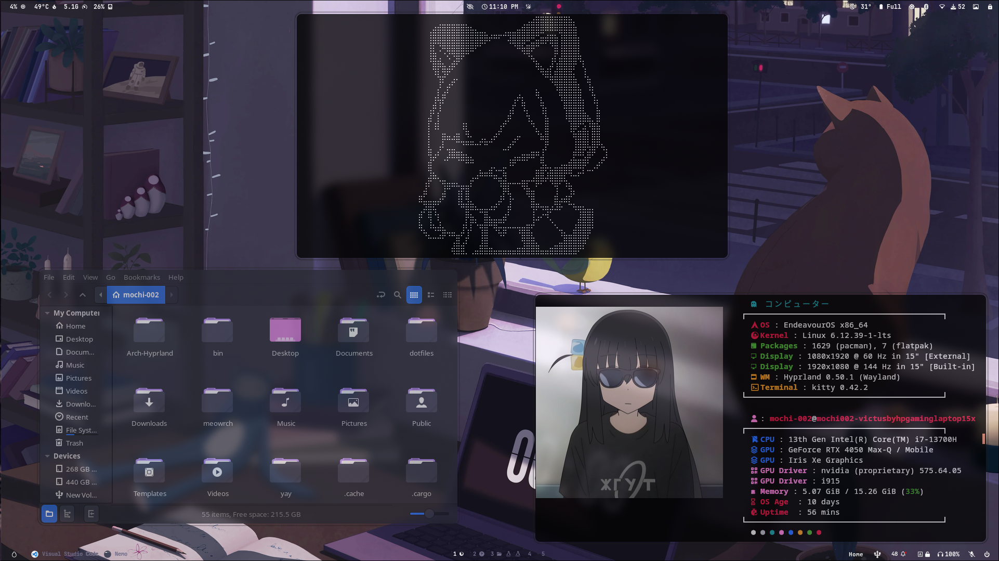
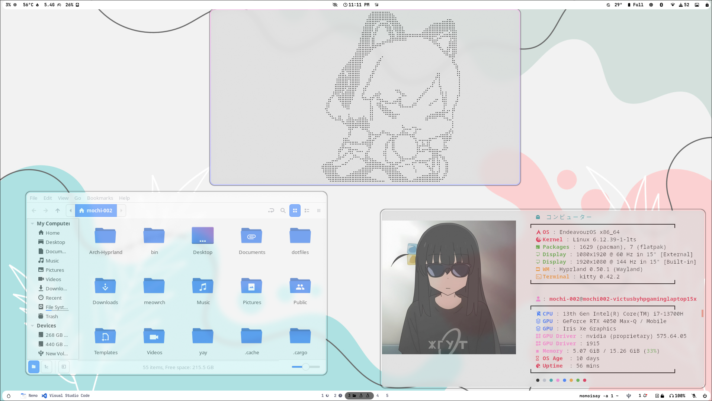
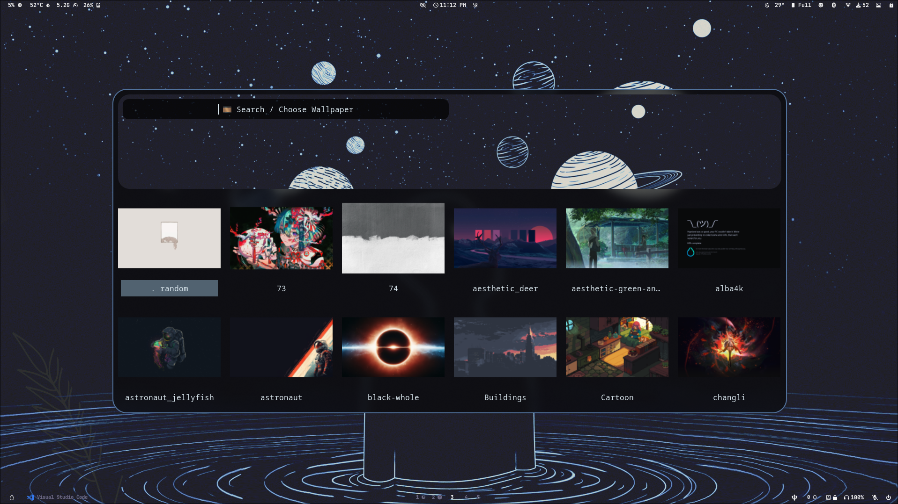
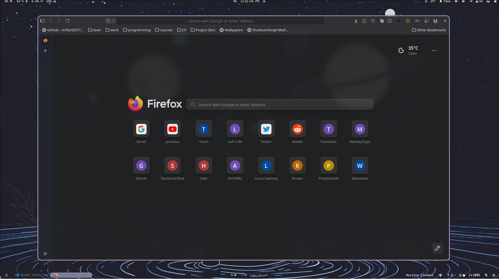
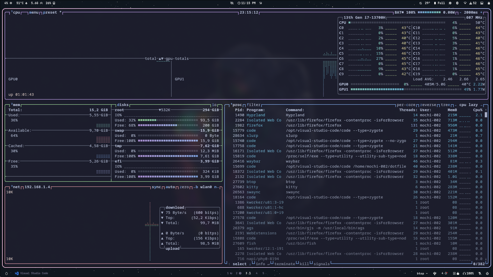
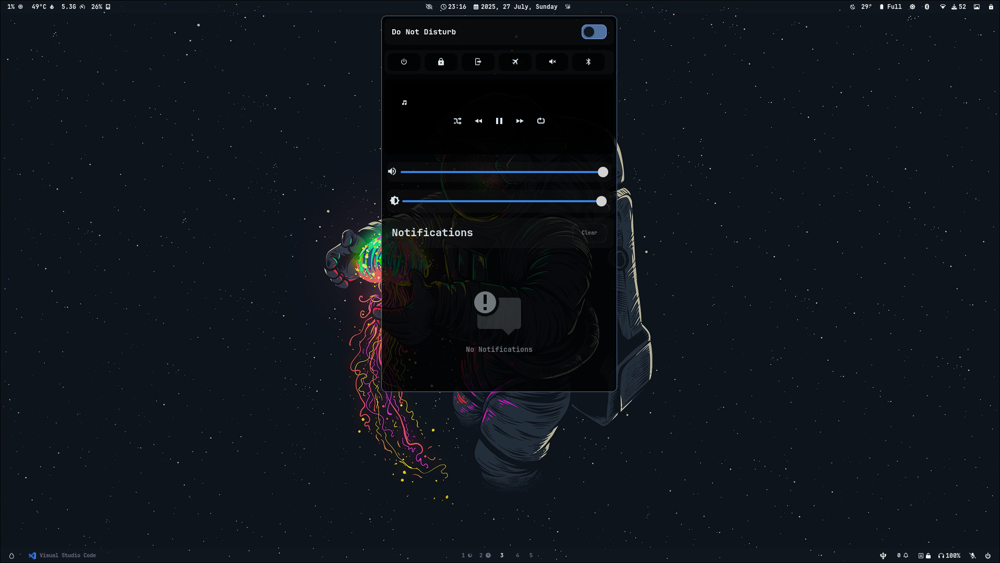
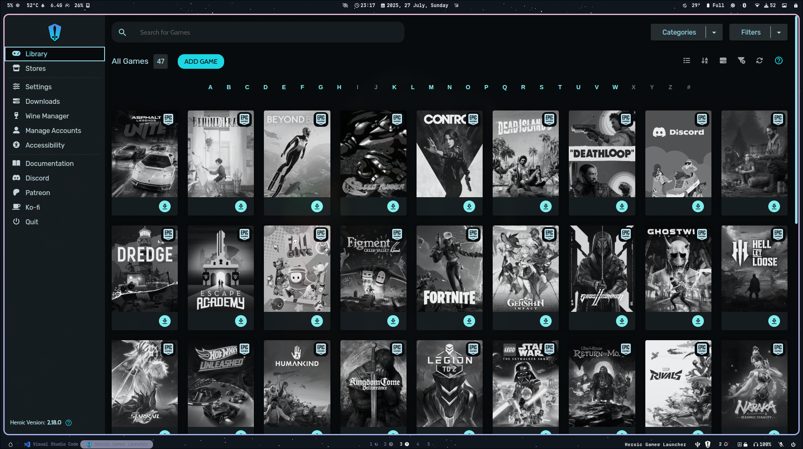

<div align="center">


# 🍡 Mochiarch — Where Rice Meets Ricing 🍡

</div>


<table align="right">

<tr><td colspan="2" align="center">⚙️ System Parameters</td></tr>
<tr><th>Component</th><th>Name</th></tr>
<tr><td>OS</td><td><a href="https://archlinux.org/">Arch btw</a> 🧠</td></tr>
<tr><td>WM</td><td><a href="https://hyprland.org/">Hyprland</a> 🌀</td></tr>
<tr><td>Bar</td><td><a href="https://github.com/Alexays/Waybar">Waybar</a> 🚥</td></tr>
<tr><td>Compositor</td><td><a href="https://github.com/yshui/picom">Picom</a> | Built-in ✨</td></tr>
<tr><td>Terminal</td><td><a href="https://github.com/kovidgoyal/kitty">Kitty</a> 🐱</td></tr>
<tr><td>App Launcher</td><td><a href="https://github.com/davatorium/rofi">Rofi</a> 🚀</td></tr>
<tr><td>Notify Daemon</td><td><a href="https://github.com/ErikReider/SwayNotificationCenter">Swaync</a> 🔔</td></tr>
<tr><td>Shell</td><td><a href="https://github.com/fish-shell/fish-shell">Fish</a> 🐟</td></tr>

</table>

## 📝 About Mochiarch

Mochiarch is like Arch Linux... but cuter 😳  
A dotfiles setup forged from the configs of the legends:  
👉 [JaKooLit](https://github.com/JaKooLit/Hyprland-Dots)  
👉 [meowrch](https://github.com/meowrch/meowrch)  

Built for power, minimalism, and pure aesthetic bliss ✨  
(also works great with your 3AM coding breakdowns)

---

## 🚀 Features

- Pre-configured like a deluxe bento box 🍱  
- One script to rice them all 🧙  
- Aesthetic? Yes. Usable? Double yes.  
- Support? As long as I don't disappear like your motivation to debug 😅

---

> ⚠️ **If it works... DON'T TOUCH ANYTHING** ✨

---

## 🖼️ Screenshots

<table align="center">
<tr><td colspan="4"></td></tr>
<tr>
<td></td>
<td></td>
<td></td>
</tr>
<tr>
<td></td>
<td></td>
<td></td>
</tr>
</table>

## 🛠 How to Install (aka: The Ritual)

Supports: **Arch**, **EndeavourOS**, **Fedora**

### 1. Clone the base installer

```bash
git clone https://github.com/meowrch/meowrch.git
```

### 2. Enter the installer directory

```bash
cd meowrch
```

### 3. Run the installer

```bash
sh install.sh
```

### 4. Clone this repo

```bash
git clone https://github.com/mochi-002/mochirch.git
```

### 5. Navigate to the project folder

```bash
cd ~/dotfiles
```

### 6. Run the full setup

```bash
sh Complete.sh
```

> 🔁 **Reboot is required** to apply changes.

> 💡 **Installer navigation:**
>
> * `Space`: Select
> * `Enter`: Next
> * `Ctrl+C`: Escape reality

---

## ⌨️ Hotkeys — aka Keyboard Wizardry

| Action                   | Keybind                       |
| ------------------------ | ----------------------------- |
| Open Terminal            | `super + enter`               |
| Launch App Menu (Rofi)   | `super + d`                   |
| Open File Manager        | `super + e`                   |
| Open Firefox             | `super + b`                   |
| Open VSCode              | `super + shift + c`           |
| Open Task Manager (btop) | `ctrl + shift + esc`          |
| Emoji Picker             | `super + .`                   |
| Power Menu               | `ctrl + alt + p`              |
| Take Screenshot          | `super + shift + PrintScreen` |
| Change Wallpaper         | `super + w`                   |
| Change Keyboard Layout   | `shift + alt`                 |
| Color Picker             | `super + c`                   |
| Lock Screen              | `ctrl + alt + l`              |
| Switch Workspaces        | `super + 1-10`                |
| Hidden Workspace         | `super + s`                   |
| Move Window to Workspace | `super + shift + 1-10`        |
| Toggle Floating Mode     | `super + space`               |
| Maximize Window          | `super + shift + f`           |
| Close Active Window      | `super + q`                   |
| Restart Rofi/Waybar      | `super + alt + r`             |
| Scripts Menu             | `super + x`                   |
| Open Keybinds List       | `super + shift + k`           |

📂 Config file:
`~/.config/hypr/UserConfigs/UserKeybindings.conf`

---

## 💻 Help?

Honestly... same 😅
But hey, open an issue — we'll suffer together 💖
